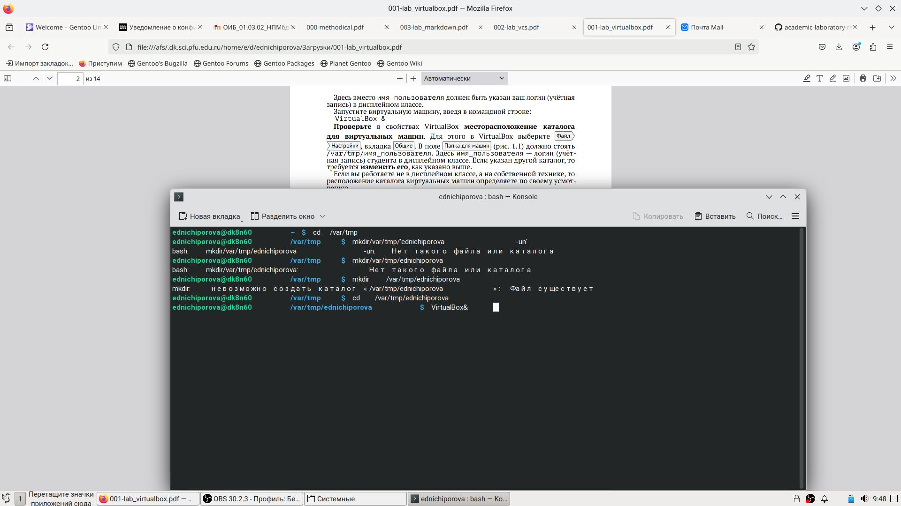
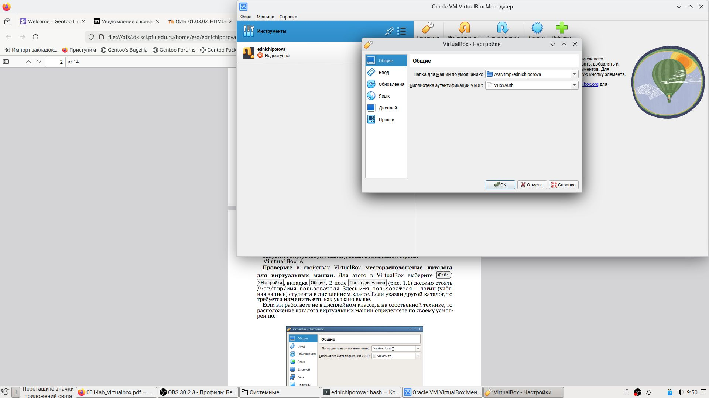
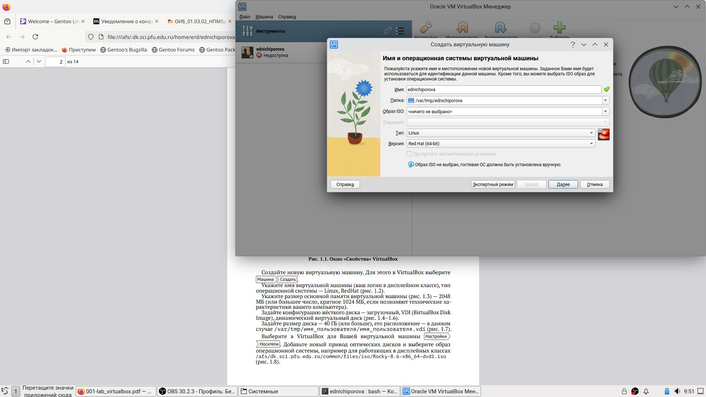

---
## Front matter
lang: ru-RU
title: Отчет по лабораторной работе 1
subtitle: Информационная безопасность
author:
  - Ничипорова Е.Д.
institute:
  - Российский университет дружбы народов, Москва, Россия
date: 04 сентября 2024

## i18n babel
babel-lang: russian
babel-otherlangs: english

## Formatting pdf
toc: false
toc-title: Содержание
slide_level: 2
aspectratio: 169
section-titles: true
theme: metropolis
header-includes:
 - \metroset{progressbar=frametitle,sectionpage=progressbar,numbering=fraction}
---

# Цель работы

Целью данной работы является приобретение практических навыков
установки операционной системы на виртуальную машину, настройки ми-
нимально необходимых для дальнейшей работы сервисов

# Выполнение лабораторной работы

Сначала я выполняю необходимые действия в консоли и захожу в Virtual Box, чтобы начать устанавливать виртуальную машину (рис. 1-3) (рис. [-@fig:001])(рис. [-@fig:002])(рис. [-@fig:003]).

{#fig:001 width=70%}
{#fig:002 width=70%}
{#fig:003 width=70%}

#Выставляю основной памяти размер 2048 Мб(рис. 4) (рис. [-@fig:004])
{#fig:001 width=70%}

#Выделаю 40 Гб памяти на виртуальном жестком диске (рис. 5) (рис. [-@fig:005])
{#fig:001 width=70%}

#Устанавливаю носители (рис. 6) (рис. [-@fig:006])
{#fig:001 width=70%}

# Остальные действия
Выбираю язык установки (рис. 7) (рис. [-@fig:007])
{#fig:001 width=70%}
Подключаю Интернет (рис. 9) (рис. [-@fig:009])
{#fig:001 width=70%}

# Остальные действия
В обзоре установки будем проверять все настройки и менять на нужные
Выбираю дополнительный язык русский(рис. 8) (рис. [-@fig:008])
{#fig:001 width=70%}
Часовой пояс поменяла на московское время
Сделала пароль для пользователя

# Остальные действия
Начинается загрузка операционной системы (рис. 10) (рис. [-@fig:010])
{#fig:001 width=70%}

# Выводы

Я приобрела практические навыки установки операционной системы на вир-
туальную машину, настройки минимально необходимых для дальнейшей ра-
боты сервисов.

:::

