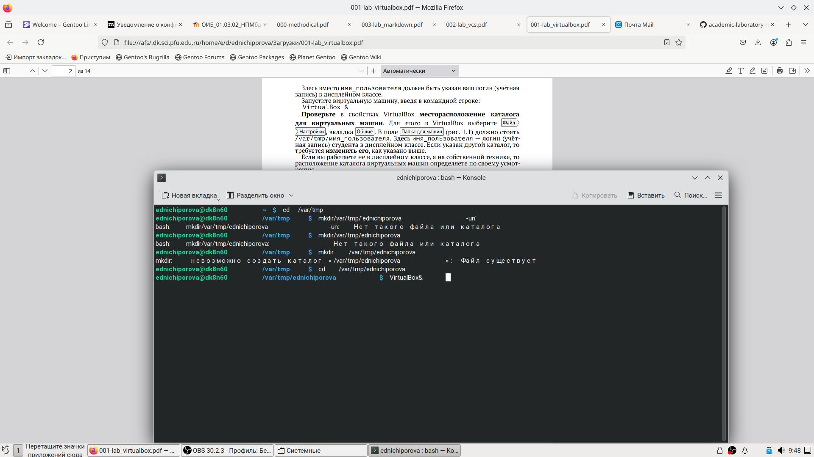
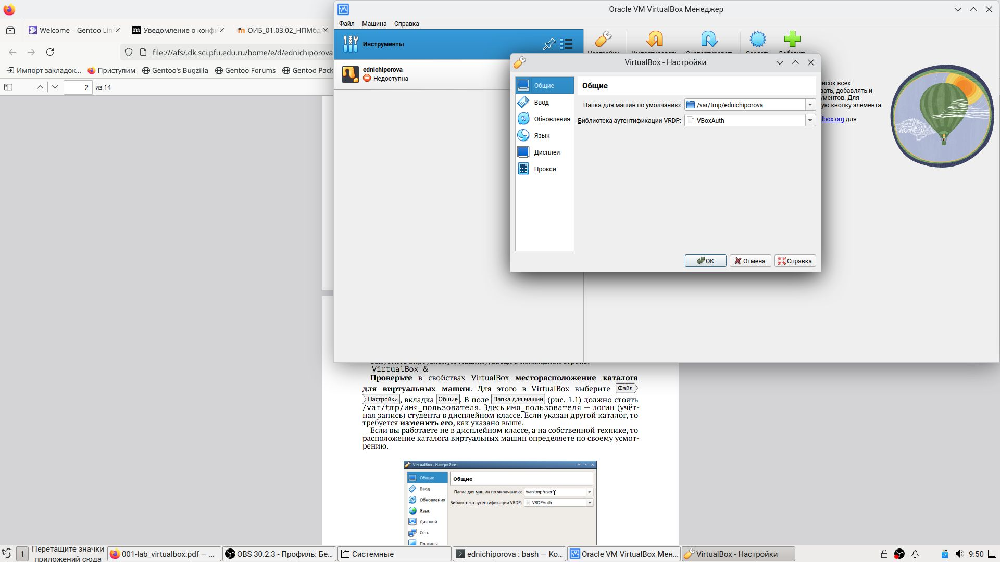
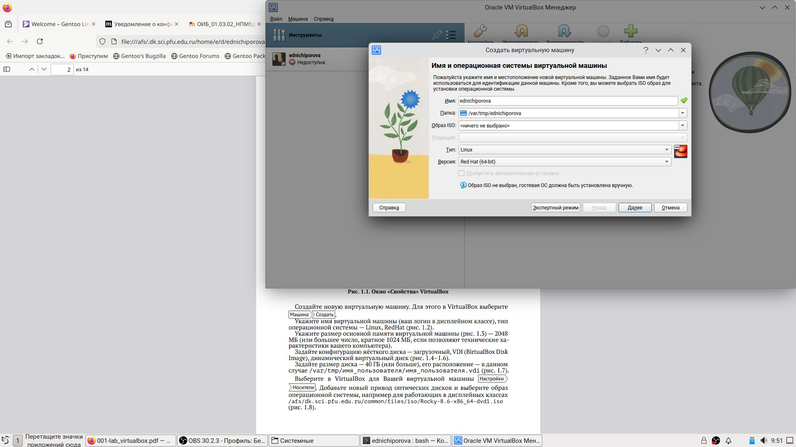

---
## Front matter
title: "Отчет по лабраторной работе №1"
subtitle: "Иформационная безопасность"
author: "Ничипорова Елена Дмитриевна"

## Generic otions
lang: ru-RU
toc-title: "Содержание"

## Bibliography
bibliography: bib/cite.bib
csl: pandoc/csl/gost-r-7-0-5-2008-numeric.csl

## Pdf output format
toc: true # Table of contents
toc-depth: 2
lof: true # List of figures
lot: true # List of tables
fontsize: 12pt
linestretch: 1.5
papersize: a4
documentclass: scrreprt
## I18n polyglossia
polyglossia-lang:
  name: russian
  options:
	- spelling=modern
	- babelshorthands=true
polyglossia-otherlangs:
  name: english
## I18n babel
babel-lang: russian
babel-otherlangs: english
## Fonts
mainfont: IBM Plex Serif
romanfont: IBM Plex Serif
sansfont: IBM Plex Sans
monofont: IBM Plex Mono
mathfont: STIX Two Math
mainfontoptions: Ligatures=Common,Ligatures=TeX,Scale=0.94
romanfontoptions: Ligatures=Common,Ligatures=TeX,Scale=0.94
sansfontoptions: Ligatures=Common,Ligatures=TeX,Scale=MatchLowercase,Scale=0.94
monofontoptions: Scale=MatchLowercase,Scale=0.94,FakeStretch=0.9
mathfontoptions:
## Biblatex
biblatex: true
biblio-style: "gost-numeric"
biblatexoptions:
  - parentracker=true
  - backend=biber
  - hyperref=auto
  - language=auto
  - autolang=other*
  - citestyle=gost-numeric
## Pandoc-crossref LaTeX customization
figureTitle: "Рис."
tableTitle: "Таблица"
listingTitle: "Листинг"
lofTitle: "Список иллюстраций"
lotTitle: "Список таблиц"
lolTitle: "Листинги"
## Misc options
indent: true
header-includes:
  - \usepackage{indentfirst}
  - \usepackage{float} # keep figures where there are in the text
  - \floatplacement{figure}{H} # keep figures where there are in the text
---

# Цель работы

Целью данной работы является приобретение практических навыков
установки операционной системы на виртуальную машину, настройки ми-
нимально необходимых для дальнейшей работы сервисов

# Задание

Лабораторная работа подразумевает установку на виртуальную машину
VirtualBox (https://www.virtualbox.org/) операционной системы Linux
(дистрибутив Rocky (https://rockylinux.org/) или CentOS (https://
www.centos.org/)).
Выполнение работы возможно как в дисплейном классе факультета
физико-математических и естественных наук РУДН, так и дома. Описание
выполнения работы приведено для дисплейного класса со следующими ха-
рактеристиками:
– Intel Core i3-550 3.2 GHz, 4 GB оперативной памяти, 20 GB свободного
места на жёстком диске;
– ОС Linux Gentoo (http://www.gentoo.ru/);
– VirtualBox верс. 6.1 или старше;
– каталог с образами ОС для работающих в дисплейном классе:
/afs/dk.sci.pfu.edu.ru/common/files/iso/

# Выполнение лабораторной работы

Я выполняю лабораторную работу на домашнем оборудовании, поэтому со-
здаю новую виртуальную машину в VirtualBox, выбираю имя, местоположение
и образ ISO, устанавливать будем операционную систему Rocku DVD (рис. 1-3) (рис. [-@fig:001])(рис. [-@fig:002])(рис. [-@fig:003]).

{#fig:001 width=70%}
{#fig:002 width=70%}
{#fig:003 width=70%}

Выставляю основной памяти размер 2048 Мб(рис. 4) (рис. [-@fig:004])
{#fig:001 width=70%}
Выделаю 40 Гб памяти на виртуальном жестком диске (рис. 5) (рис. [-@fig:005])
{#fig:001 width=70%}
Устанавливаю носители (рис. 6) (рис. [-@fig:006])
{#fig:001 width=70%}
Соглашаюсь с проставленными настройками 
Выбираю язык установки (рис. 7) (рис. [-@fig:007])
{#fig:001 width=70%}
Подключаю Интернет (рис. 9) (рис. [-@fig:009])
{#fig:001 width=70%}
В обзоре установки будем проверять все настройки и менять на нужные
Выбираю дополнительный язык русский(рис. 8) (рис. [-@fig:008])
{#fig:001 width=70%}
Часовой пояс поменяла на московское время
Сделала пароль для пользователя
Отключила kdump
Начинается загрузка операционной системы (рис. 10) (рис. [-@fig:010])
{#fig:001 width=70%}

# Ответы на контрольные вопросы
1.Учетная запись содержит необходимые для идентификации пользователя
при подключении к системе данные, а так же информацию для авториза-
ции и учета: системного имени (user name) (оно может содержать только
латинские буквы и знак нижнее подчеркивание, еще оно должно быть уни-
кальным), идентификатор пользователя (UID) (уникальный идентифика-
тор пользователя в системе, целое положительное число), идентификатор
группы (CID) (группа, к к-рой относится пользователь. Она, как минимум,
одна, по умолчанию - одна), полное имя (full name) (Могут быть ФИО), до-
машний каталог (home directory) (каталог, в к-рый попадает пользователь
после входа в систему и в к-ром хранятся его данные), начальная оболочка
(login shell) (командная оболочка, к-рая запускается при входе в систему).
2. Для получения справки по команде: —help; для перемещения по файловой
системе - cd; для просмотра содержимого каталога - ls; для определения
объёма каталога - du ; для создания / удаления каталогов - mkdir/rmdir; для
создания / удаления файлов - touch/rm; для задания определённых прав на
файл / каталог - chmod; для просмотра истории команд - history
3. Файловая система - это порядок, определяющий способ организации и
хранения и именования данных на различных носителях информации.
Примеры: FAT32 представляет собой пространство, разделенное на три
части: олна область для служебных структур, форма указателей в виде
таблиц и зона для хранения самих файлов. ext3/ext4 - журналируемая
файловая система, используемая в основном в ОС с ядром Linux.
4.С помощью команды df, введя ее в терминале. Это утилита, которая пока-
зывает список всех файловых систем по именам устройств, сообщает их
размер и данные о памяти. Также посмотреть подмонтированные файло-
вые системы можно с помощью утилиты mount.
5. Чтобы удалить зависший процесс, вначале мы должны узнать, какой у него
id: используем команду ps. Далее в терминале вводим команду kill < id про-
цесса >. Или можно использовать утилиту killall, что “убьет” все процессы,
которые есть в данный момент, для этого не нужно знать id процесса.

# Выводы

Я приобрела практические навыки установки операционной системы на вир-
туальную машину, настройки минимально необходимых для дальнейшей ра-
боты сервисов.

# Список литературы{.unnumbered}
-https://skillbox.ru/media/code/kak-ustanovit-virtualbox-i-zapustit-svoyu-pervuyu-virtualnuyu-mashinu/

::: {#refs}
:::
