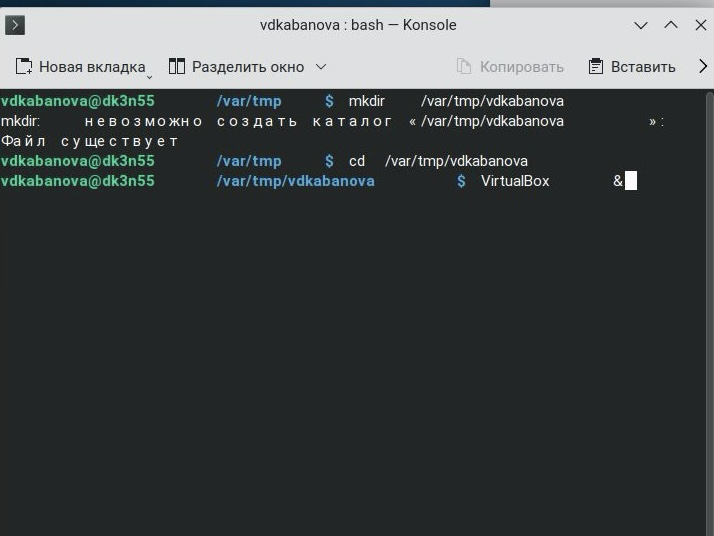
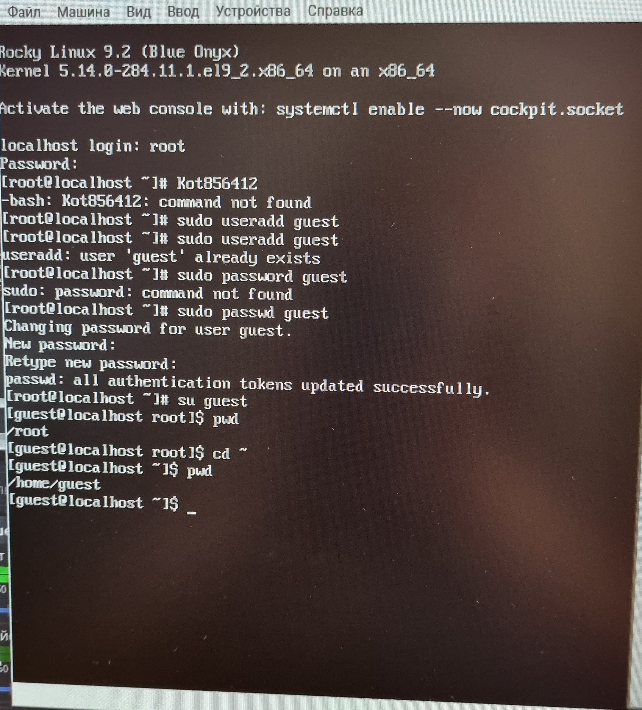
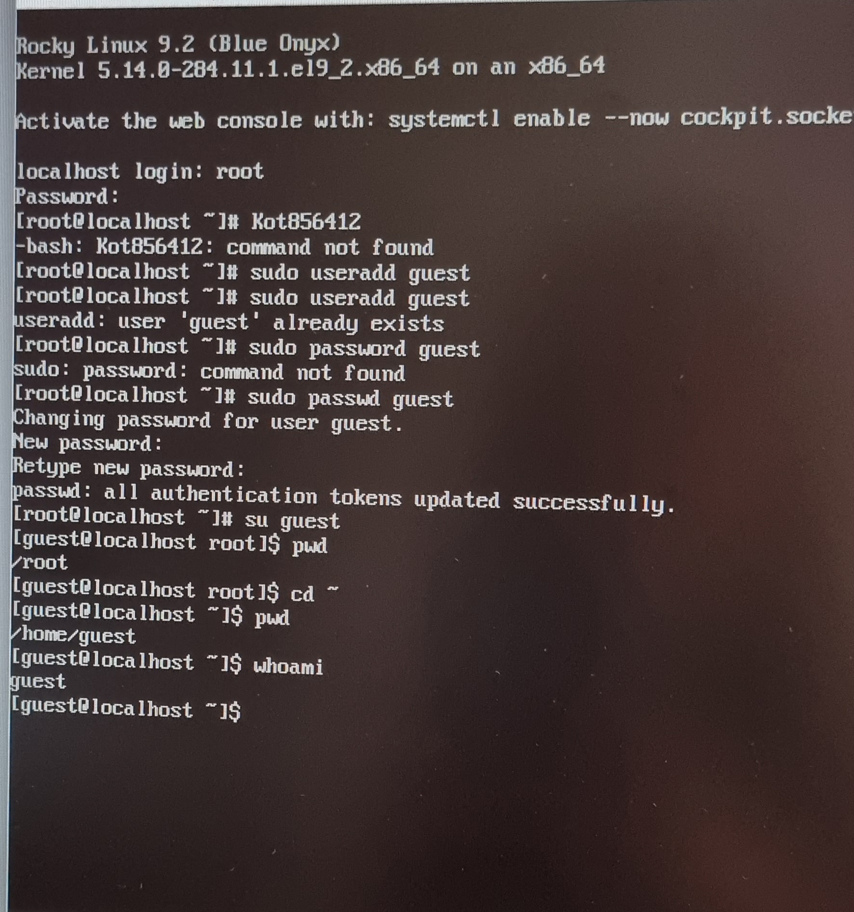
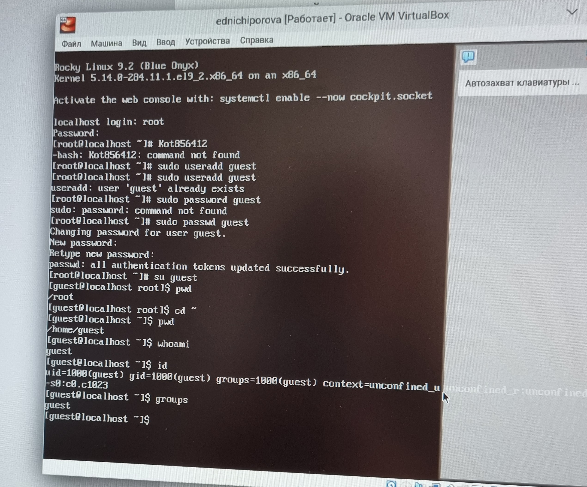
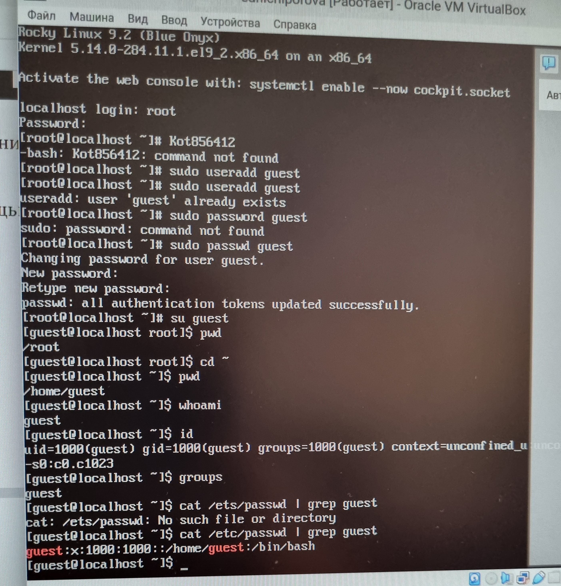
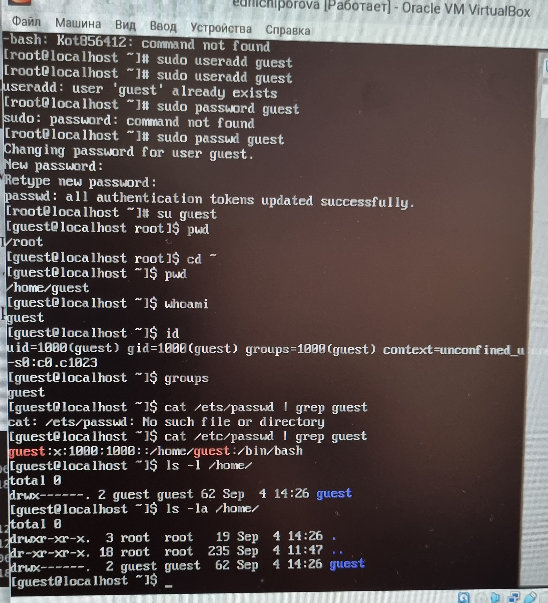
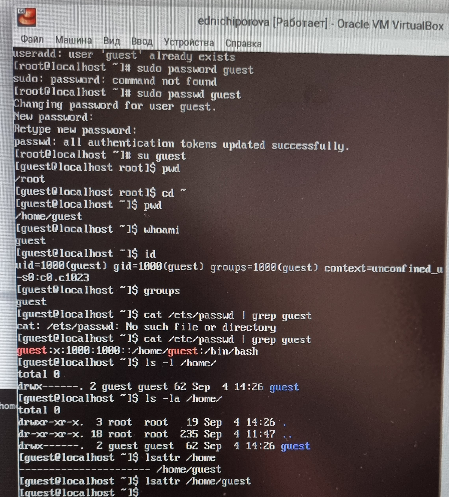
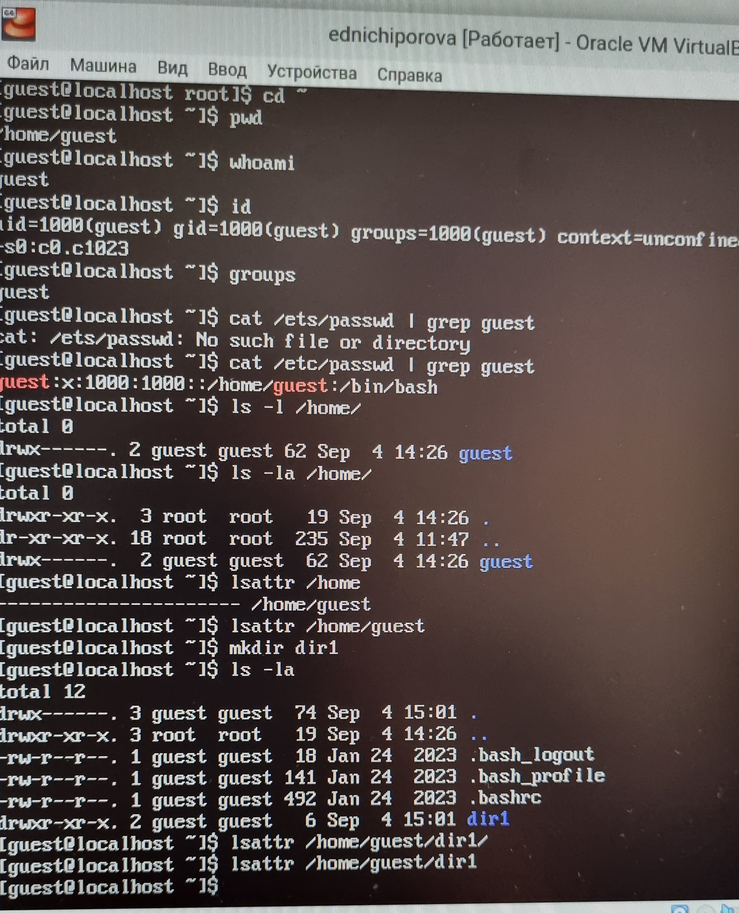
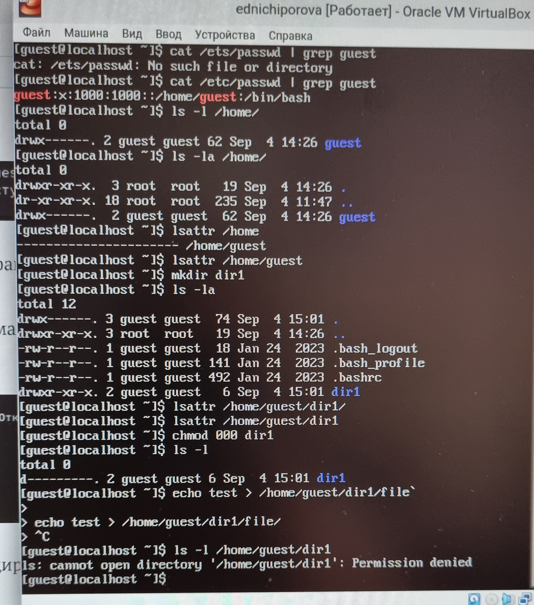
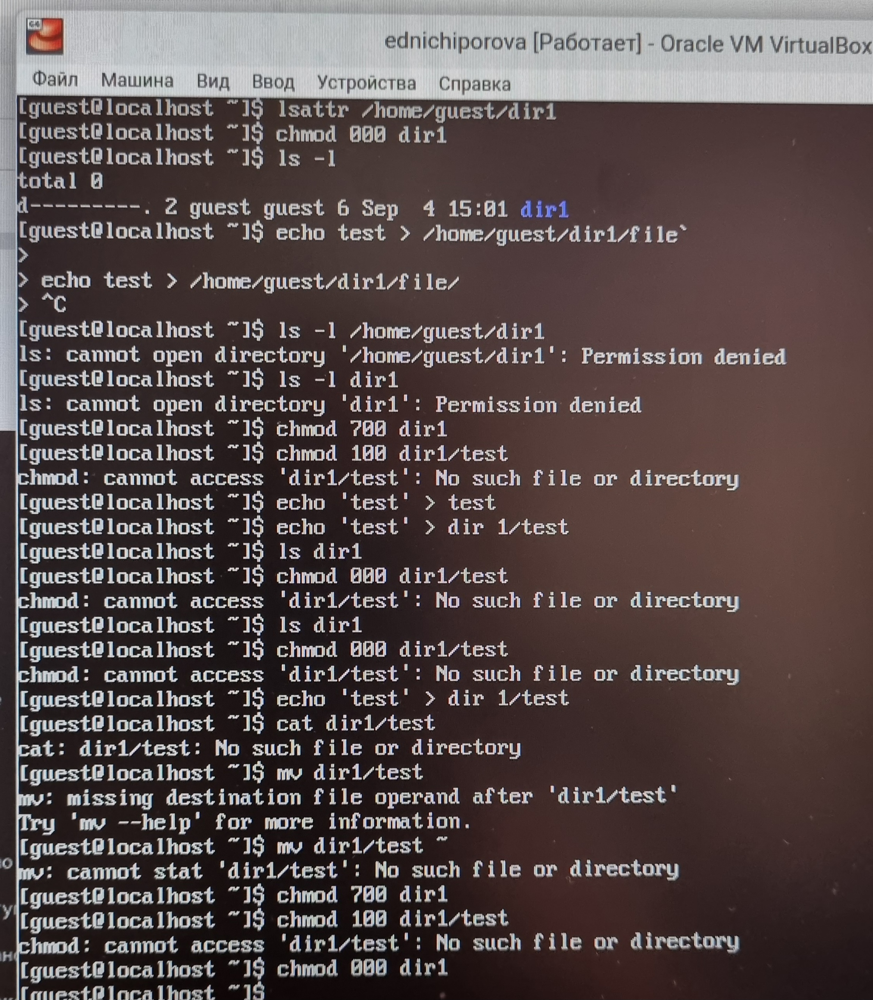

---
## Front matter
lang: ru-RU
title: Лабораторная работа №2
subtitle: Информационная безопасность
author:
  - Ничипорова Е.Д.
institute:
  - Российский университет дружбы народов, Москва, Россия
 
date: 09 сентября  2024

## i18n babel
babel-lang: russian
babel-otherlangs: english

## Formatting pdf
toc: false
toc-title: Содержание
slide_level: 2
aspectratio: 169
section-titles: true
theme: metropolis
header-includes:
 - \metroset{progressbar=frametitle,sectionpage=progressbar,numbering=fraction}
---

# Цель работы

Получение практических навыков работы в консоли с атрибутами файлов, закрепление теоретических основ дискреционного разграничения доступа в современных системах с открытым кодом на базе ОС Linux

# Задание

1. Работа с атрибутами файлов
2. Заполнение таблицы "Установленные права и разрешённые действия" 
3. Заполнение таблицы "Минимальные права для совершения операций" 

# Выполнение лабораторной работы

1. В операционной системе Rocky создаю нового пользователя guest через учетную запись администратора (рис. 1).

{#fig:001 width=70%}

2. Далее задаю пароль для созданной учетной записи и меняю пользователя на guest  с помощью команды su guest (рис. 2). 

{#fig:002 width=70%}


# Выполнение лабораторной работы
3. Определяю с помощью команды pwd, что я нахожусь в директории /home/guest/. Эта директория является домашней, ведь в приглашении командой строкой стоит значок ~, указывающий, что я в домашней директории. Также я уточняю имя пользователя (рис. 3).

{#fig:003 width=70%}


6. В выводе команды groups информация только о названии группы, к которой относится пользователь. В выводе команды id можно найти больше информации: имя пользователя и имя группы, также коды имени пользователя и группы  (рис. 4)

{#fig:004 width=70%}
# Выполнение лабораторной работы
. Имя пользователя в приглашении командной строкой совпадает с именем пользователя, которое выводит команда whoami (рис. 5)

{#fig:005 width=70%}

8. Получаю информацию о пользователе с помощью команды 
```
cat /etc/passwd | grep guest
```

В выводе получаю коды пользователя и группы, адрес домашней директории (рис. 6).

{#fig:006 width=70%}

# Выполнение лабораторной работы
9. Да, список поддиректорий директории home получилось получить с помощью команды ls -l, если мы добавим опцию -a, то сможем увидеть еще и директорию пользователя root. Права у директории:

root: drwxr-xr-x,

evdvorkina и guest: drwx------ (рис. 7).

{#fig:007 width=70%}

# Выполнение лабораторной работы
10. Пыталась проверить расширенные атрибуты директорий. Нет, их увидеть не удалось (рис. 8). Увидеть расширенные атрибуты других пользователей, тоже не удалось, для них даже вывода списка директорий не было.

{#fig:008 width=70%}

11. Создаю поддиректорию dir1 для домашней директории. Расширенные атрибуты командой lsattr просмотреть у директории не удается, но атрибуты есть: drwxr-xr-x, их удалось просмотреть с помощью команды ls -l (рис. 9).

{#fig:09 width=70%}

# Выполнение лабораторной работы
12. Снимаю атрибуты командой chmod 000 dir1, при проверке с помощью команды ls -l видно, что теперь атрибуты действительно сняты (рис. 10).
 
{#fig:010 width=70%}

13. Попытка создать файл в директории dir1. Выдает ошибку: "Отказано в доступе" Вернув права директории и использовав снова командy ls -l можно убедиться, что файл не был создан (рис. 11). 

{#fig:011 width=70%}

# Выводы

Были получены практические навыки работы в консоли с атрибутами файлов, закреплены теоретические основы дискреционного разграничения доступа в современных системах с открытым кодом на базе ОС Linux.
