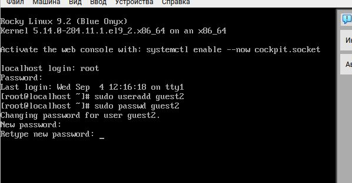
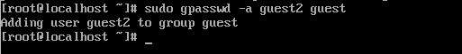
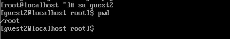
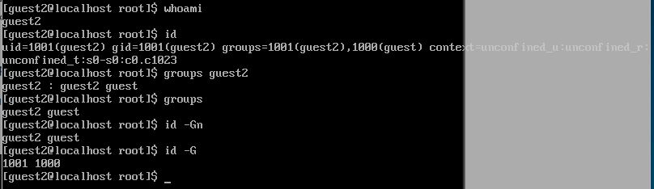
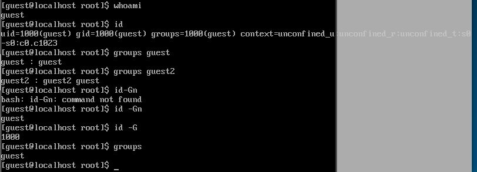
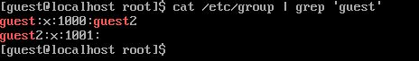
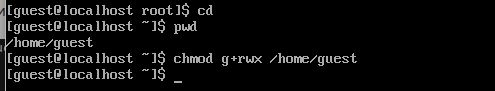
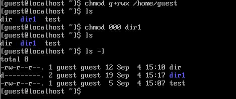

---
## Front matter
lang: ru-RU
title: Отчет по лабораторной №3
subtitle: Основы информационной безопасности
author:
  - Ничипорова Е.Д.
institute:
  - Российский университет дружбы народов, Москва, Россия

## i18n babel
babel-lang: russian
babel-otherlangs: english

## Formatting pdf
toc: false
toc-title: Содержание
slide_level: 2
aspectratio: 169
section-titles: true
theme: metropolis
header-includes:
 - \metroset{progressbar=frametitle,sectionpage=progressbar,numbering=fraction}
---
# Цель работы

Получить практические навыки работы в консоли с атрибутами файлов для групп пользователей.
# Выполнение лабораторной работы

1. Пользователь guest был создан в лабораторной работе №2, поэтому в этой лабораторной работе его не создаем заново
2. Пароль для пользователя guest тоже был задан в лабораторной работе №2. 
3. С правами администратора создаю пользователя guest с помощью команды `useradd`, далее с помощью команды `passwd` задаю пароль пользователю (рис. 1).

{#fig:001 width=70%}
# Выполнение лабораторной работы
4. Добавляю пользователя guest2 в группу guest (рис. 2).

{#fig:002 width=70%}
# Выполнение лабораторной работы
5. Зашла на двух разных консолях от имени двух разных пользователей с помощью команды `su <имя пользователя>` 

6. Проверяю путь директории, в которой я нахожусь с помощью `pwd`.

Проверка для пользователя guest (рис. 3).

{#fig:003 width=70%}

Проверка для пользователя guest2 (рис. 4).

{#fig:004 width=70%}

# Выполнение лабораторной работы
7. Проверяю имя пользователей с поомощью команды whoami, с помощью команды id могу увидеть группы, к которым принадлежит пользователь и коды этих групп (gid), команда groups просто выведет список групп, в которые входит пользователь.

Проверка для пользователя guest2 (рис. 5).

{#fig:005 width=70%}

Проверка для пользователя guest (рис. 5).

{#fig:005 width=70%}

# Выполнение лабораторной работы

8. Вывела интересующее меня содержимое файла etc/group, видно, что в группе guest два пользователя, а в группе guest2 один (рис. 7).

{#fig:006 width=70%}
# Выполнение лабораторной работы
9. От имени пользователя guest2 регистрирую его в группе guest с помощью команды `newgrp` (рис. 6).

{#fig:007 width=70%}
# Выполнение лабораторной работы
10. Добавляю права на чтение, запись и исполнение группе пользвателей guest (guest, guest2) на директорию home/guest в которой находятся все файлы для последующей работы (рис. 8).

{#fig:008 width=70%}

# Выполнение лабораторной работы
11. От имени пользователя guest снимаю все атрибуты с директории dir1, созданной в предыдущей лабораторной работе. Проверяю, что права действительно сняты (рис. 9). 

{#fig:009 width=70%}

# Выводы

Были получены практические навыки работы в консоли с атрибутами файлов для групп пользователей
