---
## Front matter
lang: ru-RU
title: Отчет по лабораторной работе №5
subtitle: Основы информационной безопасности
author:
  - Ничипорова Е.Д.
institute:
  - Российский университет дружбы народов, Москва, Россия

## i18n babel
babel-lang: russian
babel-otherlangs: english

## Formatting pdf
toc: false
toc-title: Содержание
slide_level: 2
aspectratio: 169
section-titles: true
theme: metropolis
header-includes:
 - \metroset{progressbar=frametitle,sectionpage=progressbar,numbering=fraction}
---

# Цель работы

Изучение механизмов изменения идентификаторов, применения
SetUID- и Sticky-битов. Получение практических навыков работы в кон-
соли с дополнительными атрибутами. Рассмотрение работы механизма
смены идентификатора процессов пользователей, а также влияние бита
Sticky на запись и удаление файлов.
# Выполнение лабораторной работы

Для лабораторной работы необходимо проверить, установлен ли компилятор gcc, комнда `gcc -v` позволяет это сделать. Также осуществляется отключение системы запретом с помощью `setenforce 0` (рис. 1).

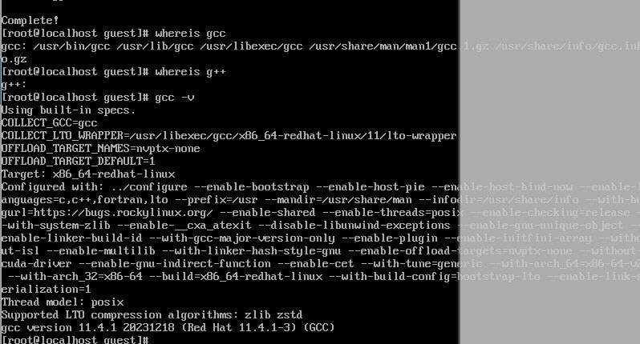{#fig:001 width=70%}

Осуществляется вход от имени пользователя guest (рис. 2).

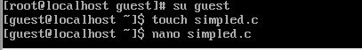{#fig:002 width=70%}

Создание файла simpled.c и запись в файл кода (рис. 2)

{#fig:002 width=70%}

Cодержимое файла выглядит следующти образом (рис. 3)

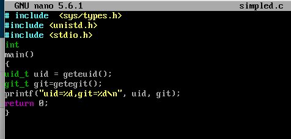{#fig:003 width=70%}

Компилирую файл, проверяю, что он скомпилировался (рис. 4)

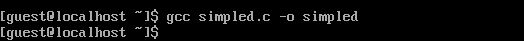{#fig:004 width=70%}

Запускаю исполняемый файл. В выводе файла выписыны номера пользоватея и групп, от вывода при вводе if, они отличаются только тем, что информации меньше 

Создание, запись в файл и компиляция файла simpled2.c. Запуск программы (рис. 5)

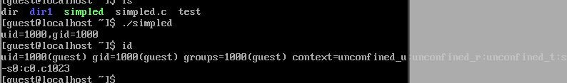{#fig:005 width=70%}

С помощью chown изменяю владельца файла на суперпользователя, с помощью chmod изменяю права доступа (рис. 7)

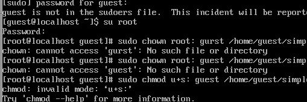{#fig:007 width=70%}

Сравнение вывода программы и команды id, наша команда снова вывела только ограниченное количество информации(рис. 8)

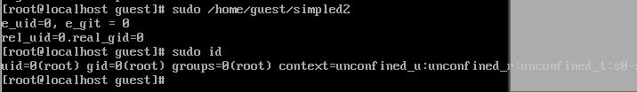{#fig:08 width=70%}

Создание и компиляция файла readfile.c 

(рис. 9)

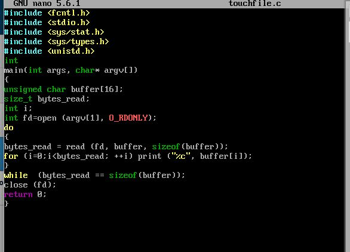{#fig:009 width=70%}

Снова от имени суперпользователи меняю владельца файла readfile. Далее меняю права доступа так, чтобы пользователь guest не смог прочесть содержимое файла (рис. 10)

{#fig:010 width=70%}

Проверка прочесть файл от имени пользователя guest.Прочесть файл не удается (рис. 11)

{#fig:011 width=70%}

Попытка прочесть тот же файл с помощью программы readfile, в ответ получаем "отказано в доступе" (рис. 12)

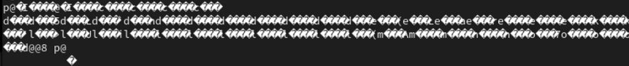{#fig:012 width=70%}

Попытка прочесть файл `\etc\shadow` с помощью программы, все еще получаем отказ в доступе (рис. 13)

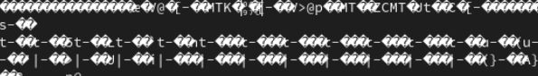{#fig:013 width=70%}

Пробуем прочесть эти же файлы от имени суперпользователя и чтение файлов проходит успешно (рис. 14)

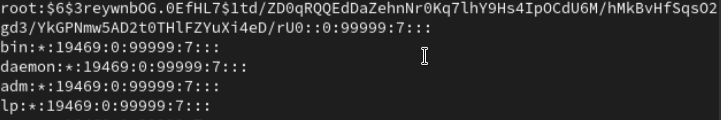{#fig:014 width=70%}

Проверяем папку tmp на наличие атрибута Sticky, т.к. в выводе есть буква t, то атрибут установлен (рис. 15)

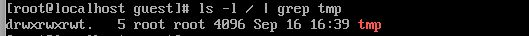{#fig:015 width=70%}

От имени пользователя guest создаю файл с текстом, добавляю права на чтение и запись для других пользователей (рис. 16)

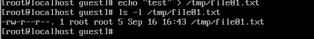{#fig:016width=70%}

Вхожу в систему от имени пользователя guest2, от его имени могу прочитать файл file01.txt, но перезаписать информацию в нем не могу (рис. 17)

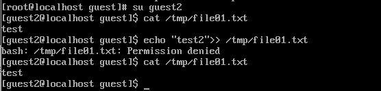{#fig:017 width=70%}

Также невозможно добавить в файл file01.txt новую информацию от имени пользователя guest2 (рис. 18)

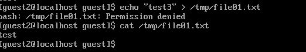{#fig:018 width=70%}

Далее пробуем удалить файл, снова получаем отказ (рис. 19)

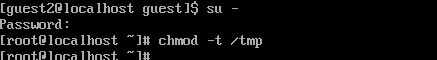{#fig:019 width=70%}

От имени суперпользователя снимаем с директории атрибут Sticky (рис. 20)

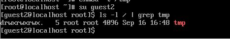{#fig:020 width=70%}

Проверяем, что атрибут действительно снят (рис. 21)

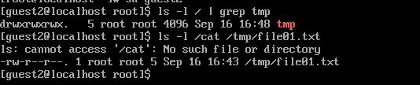{#fig:021 width=70%}

Далее был выполнен повтор предыдущих действий. По результатам без Sticky-бита запись в файл и дозапись в файл осталась невозможной, зато удаление файла прошло успешно (рис. 22)

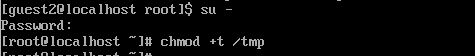{#fig:022 width=70%}

Возвращение директории tmp атрибута t от имени суперпользователя (рис. 22)

{#fig:022 width=70%}

# Выводы

Изучила механизм изменения идентификаторов, применила
SetUID- и Sticky-биты. Получила практические навыки работы в кон-
соли с дополнительными атрибутами. Рассмотрела работы механизма
смены идентификатора процессов пользователей, а также влияние бита
Sticky на запись и удаление файлов.
