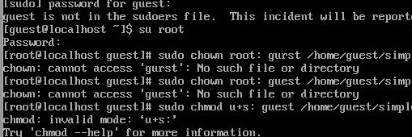

---
## Front matter
title: "Отчет по лабораторной работе №5"
subtitle: "Основы информационной безопасности"
author: "Ничипорова Елена Дмитриевна"

## Generic otions
lang: ru-RU
toc-title: "Содержание"

## Bibliography
bibliography: bib/cite.bib
csl: pandoc/csl/gost-r-7-0-5-2008-numeric.csl

## Pdf output format
toc: true # Table of contents
toc-depth: 2
lof: true # List of figures
lot: true # List of tables
fontsize: 12pt
linestretch: 1.5
papersize: a4
documentclass: scrreprt
## I18n polyglossia
polyglossia-lang:
  name: russian
  options:
	- spelling=modern
	- babelshorthands=true
polyglossia-otherlangs:
  name: english
## I18n babel
babel-lang: russian
babel-otherlangs: english
## Fonts
mainfont: PT Serif
romanfont: PT Serif
sansfont: PT Sans
monofont: PT Mono
mainfontoptions: Ligatures=TeX
romanfontoptions: Ligatures=TeX
sansfontoptions: Ligatures=TeX,Scale=MatchLowercase
monofontoptions: Scale=MatchLowercase,Scale=0.9
## Biblatex
biblatex: true
biblio-style: "gost-numeric"
biblatexoptions:
  - parentracker=true
  - backend=biber
  - hyperref=auto
  - language=auto
  - autolang=other*
  - citestyle=gost-numeric
## Pandoc-crossref LaTeX customization
figureTitle: "Рис."
tableTitle: "Таблица"
listingTitle: "Листинг"
lofTitle: "Список иллюстраций"
lotTitle: "Список таблиц"
lolTitle: "Листинги"
## Misc options
indent: true
header-includes:
  - \usepackage{indentfirst}
  - \usepackage{float} # keep figures where there are in the text
  - \floatplacement{figure}{H} # keep figures where there are in the text
---

# Цель работы

Изучение механизмов изменения идентификаторов, применения
SetUID- и Sticky-битов. Получение практических навыков работы в кон-
соли с дополнительными атрибутами. Рассмотрение работы механизма
смены идентификатора процессов пользователей, а также влияние бита
Sticky на запись и удаление файлов.

# Теоретическое введение

1. Дополнительные атрибуты файлов Linux

В Linux существует три основных вида прав — право на чтение (read), запись (write) и выполнение (execute), а также три категории пользователей, к которым они могут применяться — владелец файла (user), группа владельца (group) и все остальные (others). Но, кроме прав чтения, выполнения и записи, есть еще три дополнительных атрибута. [@u]

**Sticky bit**

Используется в основном для каталогов, чтобы защитить в них файлы. В такой каталог может писать любой пользователь. Но, из такой директории пользователь может удалить только те файлы, владельцем которых он является. Примером может служить директория /tmp, в которой запись открыта для всех пользователей, но нежелательно удаление чужих файлов.

**SUID (Set User ID)**

Атрибут исполняемого файла, позволяющий запустить его с правами владельца. В Linux приложение запускается с правами пользователя, запустившего указанное приложение. Это обеспечивает дополнительную безопасность т.к. процесс с правами пользователя не сможет получить доступ к важным системным файлам, которые принадлежат пользователю root.

**SGID (Set Group ID)**

Аналогичен suid, но относиться к группе. Если установить sgid для каталога, то все файлы созданные в нем, при запуске будут принимать идентификатор группы каталога, а не группы владельца, который создал файл в этом каталоге.

**Обозначение атрибутов sticky, suid, sgid**

Специальные права используются довольно редко, поэтому при выводе программы ls -l символ, обозначающий указанные атрибуты, закрывает символ стандартных прав доступа.

Пример:
`rwsrwsrwt`

где первая s — это suid, вторая s — это sgid, а последняя t — это sticky bit

В приведенном примере не понятно, rwt — это rw- или rwx? Определить это просто. Если t маленькое, значит x установлен. Если T большое, значит x не установлен. То же самое правило распространяется и на s.

В числовом эквиваленте данные атрибуты определяются первым символом при четырехзначном обозначении (который часто опускается при назначении прав), например в правах 1777 — символ 1 обозначает sticky bit. Остальные атрибуты имеют следующие числовое соответствие:

```
1 — установлен sticky bit
2 — установлен sgid
4 — установлен suid
```

2. Компилятор GCC

GСС - это свободно доступный оптимизирующий компилятор для языков C, C++. Собственно программа gcc это некоторая надстройка над группой компиляторов, которая способна анализировать имена файлов, передаваемые ей в качестве аргументов, и определять, какие действия необходимо выполнить. Файлы с расширением .cc или .C рассматриваются, как файлы на языке C++, файлы с расширением .c как программы на языке C, а файлы c расширением .o считаются объектными [@gcc].

# Выполнение лабораторной работы

Для лабораторной работы необходимо проверить, установлен ли компилятор gcc, комнда `gcc -v` позволяет это сделать. Также осуществляется отключение системы запретом с помощью `setenforce 0` (рис. 1).

{#fig:001 width=70%}

Осуществляется вход от имени пользователя guest (рис. 2).

{#fig:002 width=70%}

Создание файла simpled.c и запись в файл кода (рис. 2)

{#fig:002 width=70%}

```C++ Листинг 1
#include <sys/types.h>
#include <unistd.h>
#include <stdio.h>
int
main ()
{
uid_t uid = geteuid ();
gid_t gid = getegid ();
printf ("uid=%d, gid=%d\n", uid, gid);
return 0;
}
```

Cодержимое файла выглядит следующти образом (рис. 3)

{#fig:003 width=70%}

Компилирую файл, проверяю, что он скомпилировался (рис. 4)

{#fig:004 width=70%}

Запускаю исполняемый файл. В выводе файла выписыны номера пользоватея и групп, от вывода при вводе if, они отличаются только тем, что информации меньше 

Создание, запись в файл и компиляция файла simpled2.c. Запуск программы (рис. 5)

{#fig:005 width=70%}

```C++ Листинг 2
#include <sys/types.h>
#include <unistd.h>
#include <stdio.h>
int
main ()
{
uid_t real_uid = getuid ();
uid_t e_uid = geteuid ();
gid_t real_gid = getgid ();
gid_t e_gid = getegid () ;
printf ("e_uid=%d, e_gid=%d\n", e_uid, e_gid);
printf ("real_uid=%d, real_gid=%d\n", real_uid,
real_gid);
return 0;
}
```

(рис. 6)

{#fig:006 width=70%}

С помощью chown изменяю владельца файла на суперпользователя, с помощью chmod изменяю права доступа (рис. 7)

{#fig:007 width=70%}

Сравнение вывода программы и команды id, наша команда снова вывела только ограниченное количество информации(рис. 8)

{#fig:08 width=70%}

Создание и компиляция файла readfile.c 

```C++ Листинг 3
#include <fcntl.h>
#include <stdio.h>
#include <sys/stat.h>
#include <sys/types.h>
#include <unistd.h>
int
main (int argc, char* argv[])
{
unsigned char buffer[16];
size_t bytes_read;
int i;
int fd = open (argv[1], O_RDONLY);
do
{
bytes_read = read (fd, buffer, sizeof (buffer));
for (i =0; i < bytes_read; ++i) printf("%c", buffer[i]);
}
while (bytes_read == sizeof (buffer));
close (fd);
return 0;
}
```

(рис. 9)

{#fig:009 width=70%}

Снова от имени суперпользователи меняю владельца файла readfile. Далее меняю права доступа так, чтобы пользователь guest не смог прочесть содержимое файла (рис. 10)

{#fig:010 width=70%}

Проверка прочесть файл от имени пользователя guest.Прочесть файл не удается (рис. 11)

{#fig:011 width=70%}

Попытка прочесть тот же файл с помощью программы readfile, в ответ получаем "отказано в доступе" (рис. 12)

{#fig:012 width=70%}

Попытка прочесть файл `\etc\shadow` с помощью программы, все еще получаем отказ в доступе (рис. 13)

{#fig:013 width=70%}

Пробуем прочесть эти же файлы от имени суперпользователя и чтение файлов проходит успешно (рис. 14)

{#fig:014 width=70%}

Проверяем папку tmp на наличие атрибута Sticky, т.к. в выводе есть буква t, то атрибут установлен (рис. 15)

{#fig:015 width=70%}

От имени пользователя guest создаю файл с текстом, добавляю права на чтение и запись для других пользователей (рис. 16)

{#fig:016width=70%}

Вхожу в систему от имени пользователя guest2, от его имени могу прочитать файл file01.txt, но перезаписать информацию в нем не могу (рис. 17)

{#fig:017 width=70%}

Также невозможно добавить в файл file01.txt новую информацию от имени пользователя guest2 (рис. 18)

{#fig:018 width=70%}

Далее пробуем удалить файл, снова получаем отказ (рис. 19)

{#fig:019 width=70%}

От имени суперпользователя снимаем с директории атрибут Sticky (рис. 20)

{#fig:020 width=70%}

Проверяем, что атрибут действительно снят (рис. 21)

{#fig:021 width=70%}

Далее был выполнен повтор предыдущих действий. По результатам без Sticky-бита запись в файл и дозапись в файл осталась невозможной, зато удаление файла прошло успешно (рис. 22)

{#fig:022 width=70%}

Возвращение директории tmp атрибута t от имени суперпользователя (рис. 22)

{#fig:022 width=70%}

# Выводы

Изучила механизм изменения идентификаторов, применила
SetUID- и Sticky-биты. Получила практические навыки работы в кон-
соли с дополнительными атрибутами. Рассмотрела работы механизма
смены идентификатора процессов пользователей, а также влияние бита
Sticky на запись и удаление файлов.

# Список литературы{.unnumbered}

::: {#refs}
:::
