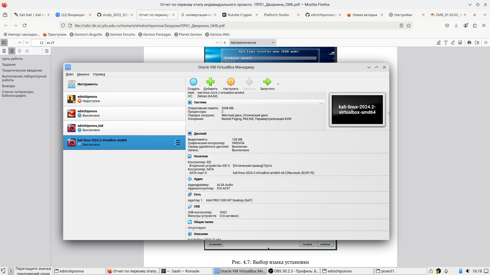
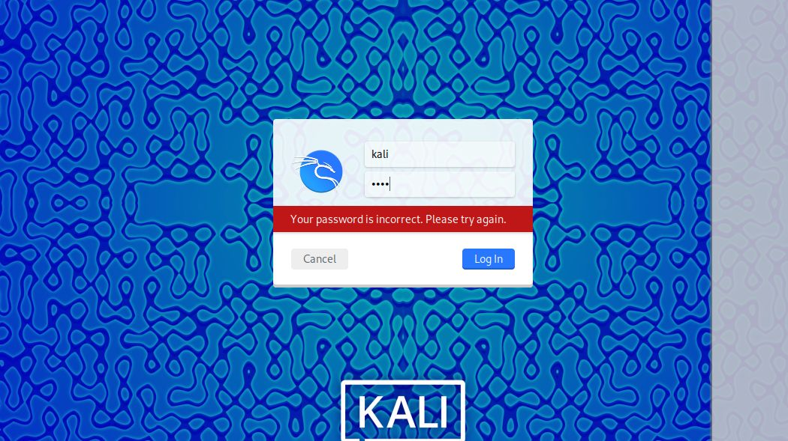
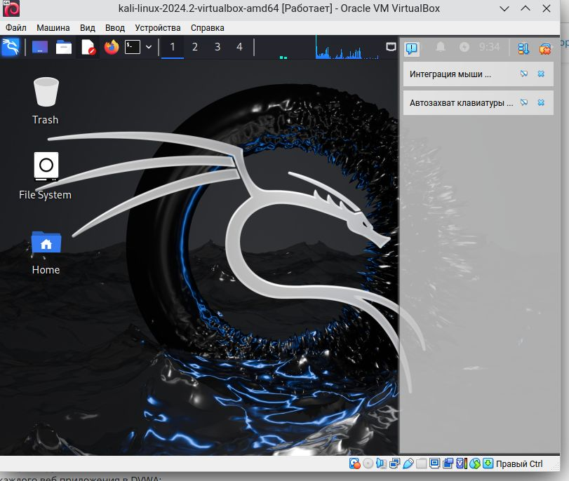

---
## Front matter
lang: ru-RU
title: Отчет по 1 этапу персонального проекта
subtitle: Информационная безопасность
author:
  - Ничипорова Е.Д.
institute:
  - Российский университет дружбы народов, Москва, Россия
  
date: 09 сентября 2024

## i18n babel
babel-lang: russian
babel-otherlangs: english

## Formatting pdf
toc: false
toc-title: Содержание
slide_level: 2
aspectratio: 169
section-titles: true
theme: metropolis
header-includes:
 - \metroset{progressbar=frametitle,sectionpage=progressbar,numbering=fraction}
---

# Цель работы

Приобретение практических навыков по установке операционной системы Linux на виртуальную машину.

# Задание

Установить дистрибутив Kali Linux на виртуальную машину VirtualBox.

# Выполнение лабораторной работы

1. Я скачала  по ссылке дистрибутив Kali Linux  и открыла его в виртуальной машинерис. ([-@fig:001]).

{#fig:001 width=70%}

2.Запустила Kali Linux

# Выполнение лабораторной работы

3.После загрузки появилось окно для ввода пароля и логина. Ввела пароль kali и логин kali ([-@fig:002]).

{#fig:002 width=70%}
4. Успешно завершила установку Kali Linux([-@fig:003]).

{#fig:003 width=70%}

# Выводы

Приобрела практические навыки по установке операционной системы Linux на виртуальную машину. Установила дистрибутив Kali LInux на VirtualBox.

