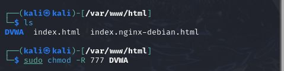
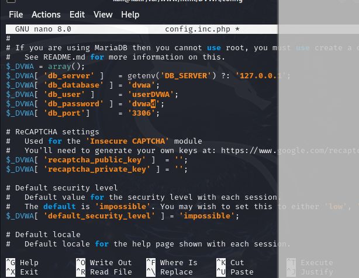
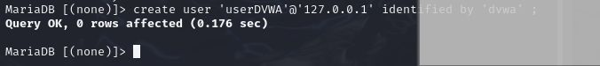
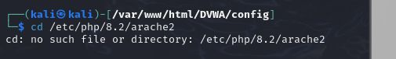
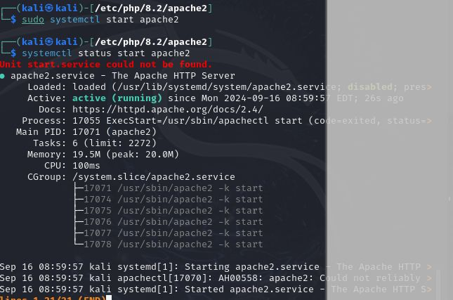
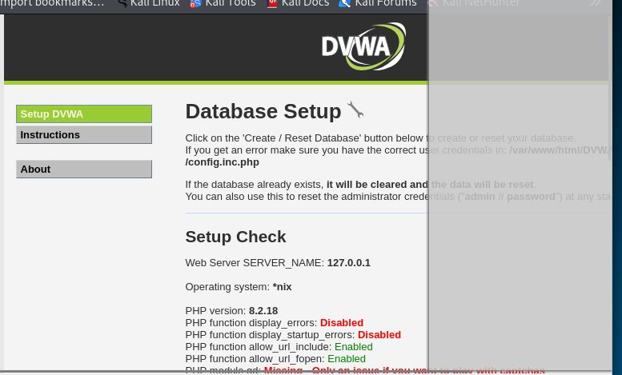
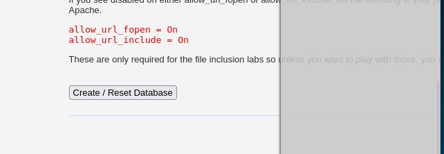

---
## Front matter
lang: ru-RU
title: Отчет по второму этапу персонального проекта
subtitle: основы информационной безопасности
author:
  - Ничипорова Е.Д.
institute:
  - Российский университет дружбы народов, Москва, Россия
  - Объединённый институт ядерных исследований, Дубна, Россия
date: 01 января 1970

## i18n babel
babel-lang: russian
babel-otherlangs: english

## Formatting pdf
toc: false
toc-title: Содержание
slide_level: 2
aspectratio: 169
section-titles: true
theme: metropolis
header-includes:
 - \metroset{progressbar=frametitle,sectionpage=progressbar,numbering=fraction}
---

# Цель работы

Приобретение практических навыков по установке DVWA.

# Выполнение лабораторной работы

Настройка DVWA происходит на нашем локальном хосте, поэтому нужно перейти в директорию `/var/www/html`. Затем клонирую нужный репозиторий GitHub (рис. 1).

{#fig:001 width=70%}
# Выполнение лабораторной работы
Проверяю, что файлы склонировались правильно, далее повышаю права доступа к этой папке до 777 (рис. 2.)

{#fig:002 width=70%}
# Выполнение лабораторной работы
Чтобы настроить DVWA, нужно перейти в каталог `/dvwa/config`, затем проверяю содержимое каталога (рис. 3)

{#fig:003 width=70%}

Создаем копию файла, используемого для настройки DVWA `config.inc.php.dist` с именем `config.inc.php`. Копируем файл, а не изменяем его, чтобы у нас был запасной вариант, если что-то пойдет не так (рис. 4)

{#fig:004 width=70%}
# Выполнение лабораторной работы
Далее открываю файл в текстовом редакторе (рис. 5)

{#fig:005 width=70%}

Изменяю данные об имени пользователя и пароле (рис. 6)

{#fig:006 width=70%}

По умолчанию в Kali Linux установлен mysql, поэтому можно его запустить без предварительного скачивания, далее выполняю проверку, запущен ли процесс (рис. 7)

{#fig:007 width=70%}
# Выполнение лабораторной работы
Авторизируюсь в базе данных от имени пользователя root. Появляется командная строка с приглашением "MariaDB", далее создаем в ней нового пользователя, используя учетные данные из файла config.inc.php (рис. 8)

{#fig:008 width=70%}

Теперь нужно пользователю предоставить привилегии для работы с этой базой данных (рис. 9)

{#fig:009 width=70%}

Необходимо настроить сервер apache2, перехожу в соответствующую директорию (рис. 10)

{#fig:010 width=70%}
# Выполнение лабораторной работы
В файле `php.ini` нужно будет изменить один параметр, поэтому открываю файл в текстовом редакторе (рис. 11)

{#fig:011 width=70%}

В файле параметры allow_url_fopen и allow_url_include должны быть поставлены как `On` (рис. 12)

{#fig:012 width=70%}

Запускаем службу веб-сервера apache и проверяем, запущена ли служба (рис. 13)

{#fig:013 width=70%}
# Выполнение лабораторной работы
Мы настроили DVWA, Apache и базу данных, поэтому открываем браузер и запускаем веб-приложение, введя 127.0.0/DVWA (рис. 14)

{#fig:014 width=70%}

Прокручиваем страницу вниз и нажимем на кнопку `create\reset database` (рис. 15)

{#fig:015 width=70%}
# Выполнение лабораторной работы
Авторизуюсь с помощью предложенных по умолчанию данных (рис. 16)

{#fig:016 width=70%}

Оказываюсь на домшней странице веб-приложения, на этом установка окончена (рис. 17)

{#fig:017 width=70%}

# Выводы

Приобрела практические навыки по установке уязвимого веб-приложения DVWA.

