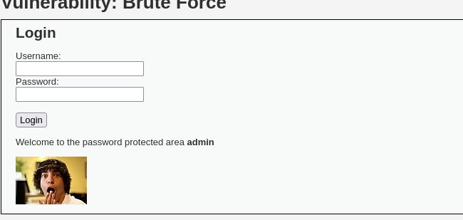

---
## Front matter
lang: ru-RU
title: Отчет по 3 этапу персонального проекта
subtitle: Основы информационной безопасности
author:
  - Ничипорова Е.Д.
institute:
  - Российский университет дружбы народов, Москва, Россия

## i18n babel
babel-lang: russian
babel-otherlangs: english

## Formatting pdf
toc: false
toc-title: Содержание
slide_level: 2
aspectratio: 169
section-titles: true
theme: metropolis
header-includes:
 - \metroset{progressbar=frametitle,sectionpage=progressbar,numbering=fraction}
---

# Цель работы

Приобретение практических навыков по использованию инструмента Hydra для брутфорса паролей.

# Задание

1. Реализовать эксплуатацию уязвимости с помощью брутфорса паролей.

# Выполнение лабораторной работы

 Чтобы пробрутфорсить пароль, нужно сначала найти большой список частоиспользуемых паролей. Его можно найти в открытых источниках, я взяла стандартный список паролей `rockyou.txt` для kali linux (рис. 1).

{#fig:001 width=70%}

Захожу на сайт DVWA, полученный в ходе предыдущего этапа проекта. Для запроса hydra мне понадобятся параметры cookie с этого сайта (рис. 2).
 
{#fig:002 width=70%}
# Выполнение лабораторной работы
Чтобы получить информацию о параметрах cookie я установила соответствующее расширение для браузера [@cookies], теперь могу не только увидеть параметры cookie, но и скопировать их (рис. 3).

{#fig:003 width=70%}

Ввожу в Hydra запрос нужную информацию. Пароль будем подбирать для пользователя admin, используем GET-запрос с двумя параметрами cookie: безопасность и PHPSESSID, найденными в прошлом пункте (рис. 4).

{#fig:004 width=70%}
# Выполнение лабораторной работы
Спустя некоторое время в результат запроса появится результат с подходящим паролем (рис. 5).

{#fig:005 width=70%}

Вводим полученные данные на сайт для проверки (рис. 6).

{#fig:006 width=70%}

Получаем положительный результат проверки пароля. Все сделано верно (рис. 7).

{#fig:007 width=70%}

# Выводы

Приобрела практические навыки по использованию инструмента Hydra для брутфорса паролей